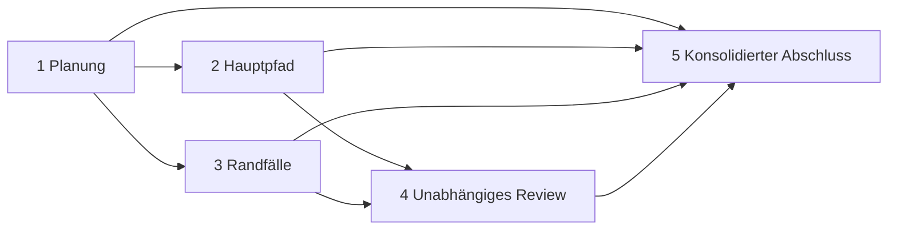

# Luczor-Agententeams: Bedienung, Architektur und Testanleitung

Diese Anleitung beschreibt den derzeit implementierten Stand der Agententeams. Sie trennt den produktiven Ablauf in Luczor vom lokalen Testlabor. Das Labor verwendet die echte Teamsteuerung, aber simulierte Adapter. Es verändert keine Projektdateien, startet weder Codex noch ein lokales Modell und führt keine Provideranfrage aus.

## 1. Was ein Standardteam ausführt

Das produktive Standardteam ist ein gerichteter, azyklischer Ablauf mit fünf Knoten:



| Knoten    | Rolle         | Zweck                                             | Standardberechtigung                              |
| --------- | ------------- | ------------------------------------------------- | ------------------------------------------------- |
| Planung   | `planner`     | Plan, Risiken und Akzeptanzkriterien erstellen    | Nur lesen                                         |
| Hauptpfad | `implementer` | Hauptpfad umsetzen oder als Patch vorschlagen     | Nur lesen; bei Codex optional Workspace schreiben |
| Randfälle | `implementer` | Fehlerpfade, Tests und Betriebsgrenzen bearbeiten | Wie Hauptpfad                                     |
| Review    | `reviewer`    | Beide Arbeitsstränge unabhängig prüfen            | Nur lesen                                         |
| Abschluss | `join`        | Plan, Ergebnisse und Review zusammenführen        | Nur lesen                                         |

Hauptpfad und Randfälle dürfen nach der Planung parallel laufen. Review und Abschluss starten erst, wenn alle jeweiligen Vorgänger erfolgreich abgeschlossen sind. Schlägt ein erforderlicher Vorgänger fehl oder wird er abgebrochen, werden abhängige Knoten übersprungen.

Die produktive Definition erlaubt maximal zwei aktive Teamknoten. Zusätzlich sperrt der Scheduler überlappende Projektordner, sobald mindestens ein Knoten schreiben darf. Lokale und richtliniengesteuerte Modellagenten beanspruchen die exklusive Ressource `local_gpu1`; deshalb läuft davon auch bei freier Teamparallelität nur einer gleichzeitig. Das Team besitzt ein Promptbudget von 96.000 Zeichen, ein Zeitbudget von 45 Minuten, 15 Minuten pro Knoten und 10 Minuten für jede erforderliche Freigabe.

## 2. Voraussetzungen im produktiven AgentHub

1. In Luczor das gewünschte Projekt aktivieren.
2. Für Codex oder schreibende Arbeit einen verfügbaren lokalen Projektordner zuordnen. Konto, Projekt-ID, kanonischer Ordner und Versionsstand der Zuordnung bilden gemeinsam den Ausführungsbereich.
3. In der Seitenleiste **Agenten & Erinnerungen** öffnen und zum Bereich **Agententeams** gehen.
4. Den **Not-Aus** deaktivieren. Für **Im Projekt schreiben** muss Luczor im Modus **Handeln** oder **Vollzugriff** stehen.
5. Die gewünschten Adapter müssen bereit sein:
   - **Codex · Coding-Agent** benötigt die installierte Codex-CLI und deren bestehende Anmeldung. Nur Codex darf Workspace-Schreibzugriff erhalten.
   - **Eigenes Modell · lokal** benötigt einen aktiven, signierten lokalen Modellkatalog mit einem für die Rolle zulässigen und auf der Hardware ausführbaren Modell.
   - **Modellrichtlinie · lokal zuerst** verwendet dieselbe lokale Zulassung und darf nur nach einer zusätzlichen Paketfreigabe auf ein externes Serverprofil ausweichen.

Ein Kontowechsel, eine geänderte oder nicht mehr verfügbare Projektordner-Zuordnung, Not-Aus sowie jeder Wechsel des Steuerungsmodus machen den alten Ausführungsbereich ungültig. Laufende beziehungsweise wartende Arbeit wird dann abgebrochen. Eine Ressource wird erst freigegeben, wenn der lokale oder native Worker seine Beendigung bestätigt hat.

## 3. Ein Team vorbereiten und freigeben

1. Ein konkretes **Teamziel** eingeben. Das Ziel darf höchstens 24.000 Zeichen enthalten.
2. Je einen Adapter für **Planung**, **Arbeitsstränge** und **Review und Abschluss** wählen. Der Abschluss verwendet denselben Adapter wie das Review.
3. Wenn die Arbeitsstränge Codex verwenden, **Nur lesen / Patchvorschlag** oder **Im Projekt schreiben** wählen.
4. Einen Freigabemodus wählen:
   - **Team einmal vollständig freigeben** zeigt zuerst den gesamten Teamrahmen mit Knoten, Adapter, Berechtigung und Abhängigkeiten. **Ganzes Team starten** autorisiert diesen Rahmen einmal.
   - **Jeden Knoten einzeln freigeben** benötigt ebenfalls die erste Freigabe des Teamrahmens. Danach erscheint jeder ausführbare Knoten mit seinem aktuellen DAG-Auftrag und den begrenzten Vorgängerausgaben. Erst **Diesen Knoten starten** gibt ihn frei.
5. **Teamlauf prüfen** wählen und Ziel, Adapter, Schreibumfang, Abhängigkeiten, Promptlimit und Zeitlimit kontrollieren.
6. Den Teamrahmen starten. Bei Einzelfreigabe anschließend jeden bereitstehenden Knoten prüfen und freigeben.

Die Oberfläche zeigt pro Knoten Warteschlange, Ausführung, externe Paketfreigabe, Ergebnis oder Fehler. **Knoten abbrechen** beendet den Knoten und überspringt seine noch nicht gestarteten Nachfolger. **Team abbrechen** beendet alle offenen Knoten.

Ein Modell oder Chat kann über `agent_team_prepare` denselben Standardrahmen vorbereiten. Dieses Werkzeug startet das Team nicht. `agent_team_status` liefert nur begrenzte Statusmetadaten und keine Prompts oder Ausgaben; `agent_team_cancel` bricht einen projektgebundenen Lauf ab. Prüfung und Start bleiben in **Agenten & Erinnerungen**.

## 4. Modellsteuerung und externe Freigabe

Luczor übersetzt die Teamrolle in einen expliziten Aufgabentyp und daraus in die benötigte lokale Modellfähigkeit:

| Rolle         | Aufgabentyp           | lokale Fähigkeit        |
| ------------- | --------------------- | ----------------------- |
| `planner`     | `planning.agent`      | `planning`              |
| `implementer` | `coding.agent`        | `execution_preparation` |
| `reviewer`    | `verification.agent`  | `reasoning`             |
| `join`        | `reasoning.synthesis` | `reasoning`             |
| `assistant`   | `chat.agent`          | `chat`                  |

Der lokale Koordinator akzeptiert nur aktivierte, ausführbare Releases mit passender Fähigkeit und ausreichender RAM-, VRAM- und Speicherzulassung. Er bereitet erst den tatsächlich gewählten Kandidaten vor. Lokale Modellagenten erhalten keine Werkzeuge und dürfen keine Dateien oder den Computer steuern.

Beim Adapter **Modellrichtlinie · lokal zuerst** bleibt der erste Versuch lokal. Ist nach der signierten Richtlinie ein externer Fallback möglich, wechselt der Knoten auf **Externe Paketfreigabe**. In **Agenten & Erinnerungen** sind Ziel, Ablaufzeit, Zeichenanzahl und die vollständigen Client-Nachrichten sichtbar. **Dieses Paket freigeben** autorisiert genau den gezeigten Client-JSON-Body, an die aktuelle Client- und Kontoidentität gebunden, einmalig und zeitlich begrenzt. Änderungen am Body oder ein zweiter externer Turn benötigen eine neue Freigabe.

Der Laravel-Proxy ordnet den Aufgabentyp einem aktiven Use Case zu, zum Beispiel `coding.*` zu `coding`, `planning.*` zu `planner` und `verification.*` zu `verifier`. Danach gelten die administrativ hinterlegte Profilreihenfolge beziehungsweise die Strategie `manual`, `ranked` oder `experiment`, aktive Credentials und Profile, angeforderte Fähigkeiten, Kontextfenster, Ein- und Ausgabelimits, aktuelle USD-Preise, Kostenbudget und maximale Versuche. Das Ranking ist profil- und aufgabentypspezifisch; es greift erst ab fünf Stichproben. Fehlende Qualitäts-, Test- oder Kostendaten bleiben unbekannt. Transportfehler, HTTP 429 und 5xx fließen in den profilgenauen Circuit Breaker ein; `Retry-After`, Abkühlzeit und ein einzelner Half-open-Probelauf begrenzen Wiederholungen.

## 5. Kontext, Projektlink und Erinnerungen

Der normale Luczor-Projektchat erstellt aus demselben Bereich zwei getrennte ContextBroker-Pakete:

- Das lokale Paket darf lokale absolute Pfade und ausdrücklich lokale Fragmente enthalten.
- Das externe Paket entfernt absolute Dateipfade und Provider-Geheimnisse, schließt `local_only`, Secrets, inaktive, fremde und nicht freigegebene Fragmente aus und hält Zeichen- und Fragmentbudgets ein.
- Der Broker dedupliziert den tatsächlich ausgewählten Inhalt. Die externe Freigabe und der spätere Versand verwenden einen Hash über den bereinigten, tatsächlich zu sendenden Client-Body.

AgentHub und Agententeams verwenden für ihre Knoten derzeit den gesonderten, providerfähigen Projektstartkontext. Er enthält den Projektalias `@project`, Projektzusammenfassung, Projektziel und offene Ziele; absolute lokale Pfade werden nicht in den Modellprompt übernommen. Standardteams beziehen Erinnerungen nicht automatisch ein. Bei einzelnen Agentenaufträgen kann **Freigegebene Projekt- und Nutzererinnerungen einbeziehen** aktiviert werden. Private oder `local_only` markierte Erinnerungen bleiben aus diesem providerfähigen Startkontext ausgeschlossen.

Ein erfolgreich abgeschlossener Codex-Auftrag kann eine native Sitzungs-ID liefern. Luczor bindet sie an Konto, Projekt, Ordner und Bindungsstand. **Verknüpfte Codex-Sitzung fortsetzen** darf nur eine von der nativen Projekt- und Sitzungsautorität zurückgegebene ID verwenden. **Im Codex-Desktop öffnen** übergibt Ordner oder Sitzung an die Desktop-App; die Rückgabe bestätigt nur diese Übergabe.

Für eine dauerhafte Übernahme unter **ChatGPT / Codex → Luczor**:

1. Als Quelle ChatGPT, Codex oder Luczor-Modellagent wählen.
2. Einen JSON-Export oder eine Markdown-/Textdatei öffnen oder Text einfügen.
3. Bei ChatGPT das gewünschte Gespräch auswählen. Es wird nur der aktive Zweig mit sichtbaren Nutzer- und Assistententexten ausgewertet; System-, Werkzeug- und interne Analyseinhalte werden verworfen.
4. Den Erinnerungstext auf die dauerhaft relevanten Aussagen kürzen und bearbeiten.
5. Optional die Freigabe für Modellabruf und Serversynchronisierung aktivieren. Ohne diese Auswahl bleibt der Import privat auf dem Gerät.
6. **Geprüfte Erinnerung übernehmen** wählen.

Der Import schreibt erst nach diesem letzten Schritt, prüft Konto und Projekt erneut, weist mögliche Zugangsdaten zurück und dedupliziert anhand Quelle, Quellenreferenz und normalisiertem Inhalt.

## 6. Browser-Testlabor ohne Provideraufrufe

Das Projekt verlangt Node.js `>=22.12.0 <23`. Unter Windows sollten Labor und Tests deshalb über den vorhandenen Wrapper mit dem projektgepinnten Node gestartet werden.

```powershell
Set-Location E:\projekte\luczor\app
.\scripts\with-pinned-node.ps1 -Executable pnpm -Arguments @('lab:teams')
```

Danach im Browser [http://127.0.0.1:1433/agent-team-lab.html](http://127.0.0.1:1433/agent-team-lab.html) öffnen. Der Vite-Server verwendet Port 1433 exklusiv; mit `Ctrl+C` wird er beendet.

### Szenario A: erfolgreicher Teamlauf

1. **Erfolg · zwei Arbeitsstränge** und **Gesamtes Team** wählen.
2. Testlauf vorbereiten und **Team freigeben und starten** wählen.
3. Prüfen, dass zuerst die Planung, dann Hauptpfad und Randfälle, danach Review und Abschluss laufen.
4. Erwartung: `5/5` abgeschlossen, Teamstatus **Team abgeschlossen**, maximal zwei Knoten gleichzeitig aktiv.
5. Unter **Übergebenen Auftrag prüfen** kontrollieren, dass Review und Abschluss die strukturierten Vorgängerausgaben als Daten enthalten.

### Szenario B: Reviewfehler

1. **Fehler im Review** vorbereiten und starten.
2. Erwartung: Planung und beide Arbeitsstränge werden abgeschlossen, das Review schlägt mit `execution_failed` fehl und der Abschluss wird mit `dependency_failed` übersprungen. Der Teamstatus lautet **Team fehlgeschlagen**.

### Szenario C: lokale Ressourcenwarteschlange

1. **Lokales Modell · eine Ressource** vorbereiten und starten.
2. Obwohl das Team zwei parallele Knoten erlaubt, müssen alle simulierten lokalen Knoten wegen `local_gpu1` nacheinander laufen.
3. Erwartung: `5/5` abgeschlossen und **1 maximal gleichzeitig aktiv**.

### Szenario D: Freigabe je Knoten

1. **Erfolg · zwei Arbeitsstränge** und **Jeden Knoten einzeln** wählen.
2. Zuerst den Teamrahmen starten, dann die Planung freigeben.
3. Nach der Planung erscheinen beide Arbeitsstränge einzeln zur Freigabe. Nach deren Abschluss folgen Review und Abschluss.
4. Vor jedem Klick den aktuellen Auftrag öffnen. Ohne Knotenfreigabe darf kein Adapter starten.

Nach einem terminalen Lauf kann **Testprotokoll exportieren** gewählt werden. Die JSON-Datei enthält die Markierung `simulation: true`, den Lauf-Snapshot, die höchste beobachtete Parallelität und das Ereignisprotokoll.

## 7. Automatisierte Teamtests

Die fokussierte Suite verwendet ebenfalls keine realen Agenten oder Provider:

```powershell
Set-Location E:\projekte\luczor\app
.\scripts\with-pinned-node.ps1 -Executable pnpm -Arguments @('test:teams')
```

Ein erfolgreicher Lauf endet mit Exitcode 0. Die Suite deckt DAG-Validierung, Abhängigkeiten, faire Parallelisierung, Ressourcen- und Workspace-Konflikte, Gesamt- und Einzelfreigaben, Prompt- und Zeitbudgets, Abbruch, UI-Ausgabe, Teamwerkzeuge, Codex-Adaptergrenzen, Execution Gate, Device Jobs und lokalen Kontextabruf ab. Für eine zusätzliche statische Prüfung:

```powershell
.\scripts\with-pinned-node.ps1 -Executable pnpm -Arguments @('typecheck')
```

## 8. Isolierter Windows-Testinstaller

Der Release-Verantwortliche erstellt den vorhandenen unsigned NSIS-Testinstaller mit:

```powershell
Set-Location E:\projekte\luczor\app
.\scripts\build-windows-test-installer.ps1
```

Das Skript verwendet den projektgepinnten Node, führt die lokale Release-Readiness aus, baut im Debug-Modus und prüft anschließend, dass die erzeugte PE-Datei unsigniert ist. Es gibt außerdem Größe und SHA-256 aus. Der erwartete Pfad lautet:

```text
E:\projekte\luczor\app\src-tauri\target\debug\bundle\nsis\Luczor Local Test_2.9.3_x64-setup.exe
```

Dieser Installer heißt **Luczor Local Test**, verwendet den separaten Identifier `de.luczor.desktop.local-test` und installiert nur für den aktuellen Windows-Benutzer. Damit ersetzt er die normale Luczor-App-Identität nicht. Build, Installation und Start sind getrennte Schritte; das Skript installiert oder startet die App nicht automatisch.

Für einen späteren nativen Test den Installer bewusst manuell installieren und starten, ein entbehrliches Testprojekt zuordnen und zunächst Projektbindung, AgentHub-Anzeige, Freigabesperren, Abbruch und Not-Aus prüfen. Providergestützte Codex- oder Policy-Läufe erst in einem separat freigegebenen Test durchführen.

## 9. Nachweisgrenzen des aktuellen Stands

- Team-DAG, Team-Prompts und Teamausgaben leben nur im Renderer und in der aktuellen App-Sitzung. Native Codex-Auftragsmetadaten und Sitzungsverknüpfungen werden gespeichert, aber nach einem Neustart gibt es keine Team-Recovery und kein Reattach eines nativen Jobs an seinen früheren Teamknoten.
- Die Einzelfreigabe zeigt den aktuellen DAG-Knotenprompt mit Vorgängerausgaben. Der standardisierte Projektstartkontext und die Rolleninstruktion werden unmittelbar danach im AgentHub ergänzt; die Teamansicht zeigt diesen endgültig zusammengesetzten Adapterprompt nicht erneut.
- Luczor legt weder automatisch ein ChatGPT-Desktop-Projekt noch einen Eintrag in der ChatGPT-/Codex-Seitenleiste an. Die Desktop-Funktion bestätigt nur die Übergabe von Ordner oder Sitzung.
- Die externe Freigabe deckt den vollständigen Client-JSON-Body und dessen Hash ab. Der Server kann anschließend administrative, Persona-, Use-Case- und Rollen-Systemprompts ergänzen. Für diesen endgültigen serverseitig erweiterten Provider-Body gibt es noch keine Vorschau und keinen an die Clientfreigabe zurückgebundenen finalen Serverhash.
- Das Browserlabor und die automatisierte Suite simulieren Adapter. Sie belegen Scheduler- und UI-Verhalten, keine reale Modellqualität, Providerverfügbarkeit, Codex-Anmeldung oder native Prozesssteuerung.
- Ein interaktiver nativer OS-Smoke mit dem isolierten Installer wurde für diesen Stand noch nicht durchgeführt. Build und Hashprüfung allein sind kein Installations- oder Laufzeitnachweis.
